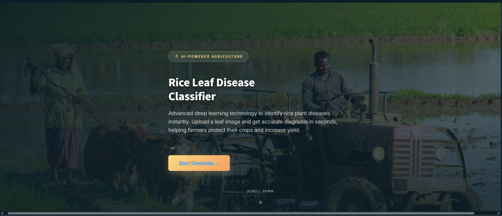
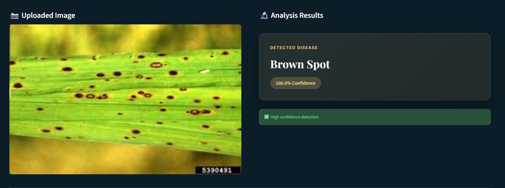

<h2>This project is a machine learning web application that predicts rice leaf diseases from uploaded images. It helps farmers and researchers identify diseases early to ensure better crop health.</h2>

<h2>🧠 Overview</h2>

The system uses a deep learning model trained on rice leaf datasets to classify images into multiple disease categories such as:
- Bacterial Blight  
- Brown Spot  
- Leaf Blast  
- Leaf Smut  
- Sheath Blight  
- Leaf Scald  
- Healthy Leaf  

---

 <h2>⚙️ Features</h2>

- Upload rice leaf images for real-time prediction  
- Displays confidence score for each prediction  
- User-friendly Streamlit web interface  
- Supports TensorFlow/Keras trained models  
- Responsive design with modern CSS  

---
<h2>🧩 Tech Stack</h2>

**Frontend:** Streamlit, HTML, CSS  
**Backend:** Python  
**Libraries:** TensorFlow, NumPy, Pillow, OpenCV, JSON  
**Dataset:** Custom rice leaf disease dataset  

---

<h2>🚀 Getting Started</h2>

### 1. Clone the Repository
git clone https://github.com/Shenol2020/Rice-Diseases-predict.git
cd Rice-Diseases-predict

for Environment
python -m venv venv

Activet 
venv\Scripts\activate

install dependencies
pip install -r requirements.txt

Run app 
streamlit run app.py

*<h3>Shenol Disanayaka*<h3>
*<h4>My First-Year Individual Project<h4>*